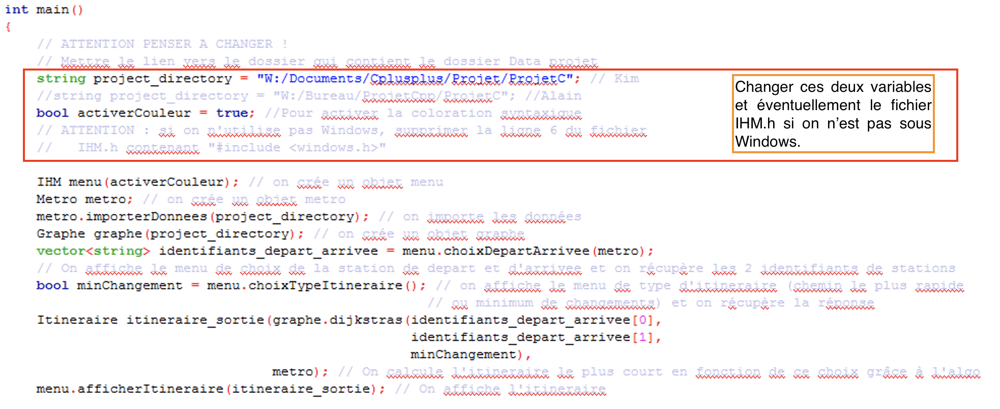

```{r setup, include=FALSE}
knitr::opts_chunk$set(echo = TRUE)
```

# Introduction

Ce rapport décrit le projet C++ de Kim Antunez et d'Alain Quartier-la-Tente (Ensae, 2A) dont l'objectif est de permettre à l'utilisateur d'obtenir un itinéraire entre deux stations de métro selon deux critères : le plus court chemin ou le chemin avec le moins de correspondances. 
L'ensemble des données et des codes utilisés sont disponibles sous https://github.com/AQLT/Metro_Cpp, la section \ref{sec:le_programme} décrivant comment utiliser l'application.
 Les données utilisées sont les données du métro parisien fournies par la RATP (section \ref{sec:def_donnees}), l'implémentation des classes est décrite dans la section \ref{sec:desc_classes}, l'algorithme utilisé pour calculer les chemins est l'algorithme de Dijkstra (section \ref{sec:algo}). 
Enfin, les pistes d'amélioration sont décrites dans la partie \ref{sec:amelioration}.

Pour mieux se retrouver dans le réseau parisien, et surtout tester la validité de l'algorithme, le plan de l'ensemble des lignes a été rajouté dans la section \ref{sec:lignes_metro}.

# Le programme {#sec:le_programme}

## Prise en main 

Afin de s'assurer que le programme tourne bien sur votre ordinateur. Veillez à effectuer les vérifications suivantes :

1. Changer le répertoire de travail (`project_directory`) : il doit s'agir du lien vers le dossier contenant le dossier `Data Projet`. Ainsi, si l'archive a été dézippée sous `D:/`, `project_directory` doit être égale à `D:/`

2. Choisir si l'on veut mettre la couleur  (booléen `activerCouleur`). Cette fonctionnalité n'est opérationnelle que sur les ordinateurs Windows car il nécessite le package `windows.h`. 

3. Lancer le programme est se laisser guider 



## Démonstration


# Description des données {#sec:def_donnees}

## Description des données à disposition

Toutes les données utilisées dans ce projet sont issues de la RATP, plus précisément de la base `offre-transport-de-la-ratp-format-gtfs` (https://dataratp.opendatasoft.com/explore/dataset/offre-transport-de-la-ratp-format-gtfs/information/). 
Ces données sont au format *General Transit Feed Specification* (GTFS) qui est un format standardisé pour diffuser des données relatives aux réseaux de transport en commun (horaires, informations géographiques, etc.). 

Pour les données de la RATP sont disponibles sous deux formes d'archives : 

- Une archive avec des fichiers GTFS réparties par lignes ;  
- Une archive avec des fichiers GTFS pour l'ensemble du réseau (métro, bus, tram et RER).

C'est la première archive que nous avons utilisée.
En effet, nous restreignons notre étude aux lignes de métro uniquement.
Nous avons stocké les données utilisées ici : https://github.com/AQLT/Metro_Cpp/tree/master/Data.

Chaque ligne de métro est associée à un dossier qui contient des données stockées dans différents fichiers :  

1. `routes.txt` : définit les itinéraires des transports en commun 
$\rightarrow$ données **utilisées** avec le fichier `trips.txt` pour identifier l'ordre de passage à chaque arrêt pour les lignes aller et retour. 

2. `stops.txt` : définit l'ensemble des arrêts où les usages peuvent monter ou descendre, avec le nom de l'arrêt, l'adresse et les coordonnées GPS 
$\rightarrow$ données **utilisées** dans ce projet pour définir l'ensemble des arrêts.

3. `stop_times.txt` : définit, pour chaque trajet et pour chaque arrêt, les heures d'arrivée et de départ du métro 
$\rightarrow$ données **utilisées** avec le fichier `trip.txt` pour connaître le temps de trajet entre deux stations de la même ligne. 

4. `transfers.txt` : définit les règles de liaison aux pôles de correspondance entre des itinéraires 
$\rightarrow$ données **utilisées** dans ce projet pour connaître les correspondances et les temps de correspondance entre les lignes.

5. `trips.txt` : définit l'ensemble des trajets pour chaque ligne (i.e. : tous les trajets prévus dans la journée) 
$\rightarrow$ données **utilisées** avec le fichier `routes.txt` et `stop_times.txt` pour identifier pour chaque ligne l'ordre de passage et le temps de trajet entre chaque arrêt
^[Dans ce projet nous ne prenons pas en compte l'heure à laquelle la recherche d'itinéraire a été faite : pour chaque "route" un seul "trip" a donc été utilisé.].

6. `calendar_dates.txt` : définit les exceptions pour les services définis dans le fichier `calendar.txt` 
$\rightarrow$ données **non utilisées** dans ce projet.

7. `calendar.txt` : définit les dates auxquelles le service est disponible pour des itinéraires spécifiques selon un calendrier hebdomadaire. 
Ce fichier spécifie les dates de début et de fin du service, ainsi que les jours de la semaine où le service est disponible 
$\rightarrow$ données **non utilisées** dans ce projet.  

8. `agency.txt` : définit une ou plusieurs agences de transports publics dont les services sont représentés dans l'ensemble de données 
$\rightarrow$ données **non utilisées** dans ce projet. 

Plus d'informations sur les données GTFS sont disponibles sur le site de Google : https://developers.google.com/transit/gtfs/reference/.

## Difficultés et solutions adoptées

Chaque arrêt est défini par une identifiant unique.
Cet identifiant est différent pour chaque ligne et pour chaque route (aller et retour) sans qu'aucune durée de correspondance n'ait été définie dans les données. 
Certains itinéraires étaient donc impossibles à calculer avec l'utilisation de ces seules données brutes.
Par exemple, si l'on est à l'arrêt de métro Gaîté sur la ligne 13 direction Châtillon-Montrouge on ne peut pas rejoindre l'arrêt Montparnasse car la ligne est orientée dans la "mauvaise direction".
$\rightarrow$ **Solution adoptée** : ajouter un temps de transfert égal à 0 permettant de passer d'un arrêt d'une ligne aller à ce même arrêt (même nom) de la ligne retour, et inversement. 
Ainsi, le temps de transfert est nul pour passer de l'arrêt de métro Gaîté sur la ligne 13 direction Châtillon-Montrouge à l'arrêt de métro Gaîté sur la ligne 13 direction Saint-Denis/Les Courtilles. 
<!-- Kim : rediscuter des limites avec Alain --> 
En revanche cela rend le calcul du temps de trajet moins fiable pour deux raisons :

1. Le temps de transfert entre deux lignes n'est pas le même en fonction de la direction que l'on prend. 

2. Pour réaliser certains itinéraires, il est nécessaire de changer de direction tout en restant sur la même ligne (par exemple sur la ligne 13 passer de Guy Môquet à Brochant il faut aller jusqu'à l'arrêt La Fourche et changer de direction). 
<!-- Fin : Kim : rediscuter des limites avec Alain --> 

Puisque nous avons fait le choix de ne pas tenir compte du temps d'attente moyen d'un métro, **le temps de trajet prévu pour chaque itinéraire est sous-estimé**.

Cette façon de numéroter les arrêts implique que certains arrêts ne sont associés qu'à une ligne (aller ou retour) alors que d'autres sont associés à deux lignes (par exemple sur la ligne 13 qui contient 2 lignes aller ou 2 lignes retour).

Plusieurs incohérences ont également été trouvées dans les données qui concernent les trajets :

<!-- Kim : pas compris --> 
-  Le fichier `routes.txt` ne permettait pas toujours de bien identifier les lignes aller et retour. 
En effet, pour certaines lignes de métro, pour le même identifiant de "trip" et pour une "route" fixée, il pouvait y avoir au même horaire un départ d'un terminus pour une direction et du terminus opposé pour l'autre direction. 
Cela devrait normalement être impossible puisque la "route" permet d'identifier la direction. 
Ce problème affecte les lignes 1, 4, 7, 7B et 13 : un travail manuel sur les bases de données a donc été réalisé pour identifier correctement les lignes aller et retour.  
<!-- Fin : Kim : pas compris --> 

- Certaines "routes" de la base de données ne correspondent pas à la réalité du réseau du métro parisien. C'est le cas d'une des routes de la ligne 10 "BOULOGNE - PONT DE SAINT CLOUD <-> GARE D'AUSTERLITZ) - Aller" qui partirait de l'arrêt Porte d'Auteuil pour ensuite aller à l'arrêt Michel-Ange Molitor et continuer direction Gare D'Austerlitz (alors que depuis Porte d'Auteuil la seule direction possible est Boulogne). Cette "route" n'a alors pas été considérée dans notre algorithme.

Pour simplifier le chargement des données en C++, nous avons pré-traité les données via le logiciel statistique \faRProject :


<!-- Kim : pas compris --> 
- Pour chaque "route" nous avons créé un fichier avec :  
    + Le fichier `stops.txt` dans lequel nous avons enlevé les accents (permet de créer l'ensemble des arrêts) ;
^[le logiciel Code::Blocks utilisé sur les postes Windows de l'Ensae génère en effet des problèmes d'encodage, ce qui ne permet pas par exemple d'afficher correctement les caractères accentués.].

    
    + L'ensemble des arrêts de manière ordonnée ainsi que le nom de la route (permet de créer toutes les lignes, d'identifier les arrêts traversés ainsi que l'ordre de passage).
<!-- Fin : Kim : pas compris --> 

- Deux matrices carrées ayant autant de colonnes et de lignes que d'identifiants d'arrêts :

<!-- Kim : revoir --> 
    + `voisins_type.txt` : la coordonnée (i,j) vaut -1 si les deux arrêts ne sont pas directement connectés, 0 si les deux arrêts en fait "les mêmes" (i.e. : ce sont des arrêts qui ont le même nom et le même numéro de ligne, cf. plus haut)  et 1 si les deux arrêts sont connectés mais sur deux lignes différentes (par exemple entre la ligne 4 et la ligne 13 à l'arrêt Montparnasse).

    + `voisins.txt` : la coordonnée (i,j) correspond au temps nécessaire pour aller directement l'arrêt i à l'arrêt j. Avec une valeur égale à -1 s'il n'y a pas de correspondance directe possible et à 0 si 0 si les deux arrêts en fait "les mêmes" (i.e. : ce sont des arrêts qui ont le même nom et le même numéro de ligne, cf. plus haut).
<!-- Fin Kim : revoir --> 

Les fichiers utilisés dans l'implémentation C++ sont disponibles sous https://github.com/AQLT/Metro_Cpp/tree/master/Data%20projet.


# Description des classes {#sec:desc_classes}


Pour l'implémentation de ce projet C++, nous avons créé huit classes qui pouvant être rassemblées en quatre groupes :

1. Les classes liées à la représentation des données du métro parisien. Il s'agit des classes `Arret`, `Ligne` et  `Metro`.

2. Les classes liées à l'algorithme du plus court chemin. Il s'agit des classes `Node`, `Edge` et `Graphe`.

3. Une classe permettant de faire le lien entre les données et l'algorithme. Il s'agit de la classe `Itineraire`.

4. Une classe générant l'Interface Homme-Machine. Il s'agit de la classe `IHM`.

La figure \ref{fig:diag_classes} décrit les relations entre toutes ces classes.
Elle reprend un certain nombre de conventions d'un diagramme de classe en UML. Comme par exemple :

- Les objets de type public sont préfixés d'un "+" et de type privé d'un "-"


Sans pour autant respecter toutes ses normes. Comme par exemple : 

- Les constructeurs ne figurent pas sur ce schéma, à l'exception d'un des constructeurs d'Itineraire. 


Des informations supplémentaires sur les méthodes mobilisées dans chaque classe sont disponibles dans le code du projet.

## Classes liées au réseau de métro parisien

À partir des données décrites dans la section \ref{sec:def_donnees}, nous avons créé quatre classes :

1. La classe `Arret` est la classe qui représente un arrêt de métro tel que définit dans la base de données de la RATP : il dépend donc du numéro de la ligne ainsi que de la direction. 
Il y a donc par exemple deux objets `Arret` associés à l'arrêt "Gaîté" (un qui correspond à l'arrêt Gaîté sur la ligne 13 direction Châtillon-Montrouge et un qui correspond à l'arrêt Gaîté sur la ligne 13 direction Saint-Denis/Les Courtilles) et quatre objets `Arret` associés à l'arrêt Denfert-Rochereau (deux sur la ligne 4 et deux sur la ligne 5). 
Chaque arrêt peut être associé à un ou plusieurs objets `Ligne`.

2. La classe `Ligne` représente un ensemble ordonné d'objets `Arret` et définissent l'ensemble des arrêts d'une ligne et est associé à une direction. 
Ainsi, pour la ligne 4 il y a deux objets `Ligne` qui correspondent au chemin de la ligne 4 direction Mairie de Montrouge et au chemin de la ligne 4 direction Porte de Clignancourt. 
De la même façon pour la ligne 13 il y a quatre objets `Ligne`.

3. La classe `Metro` est la classe qui synthétise le réseau : elle contient l'ensemble des objets `Arret` et l'ensemble des objets `Ligne`.


## Classes liées à l'algorithme du plus court chemin

Trois classes ont été créées pour implémenter l'algorithme de Dijkstra :

1. La classe `Node` est la classe qui représente un sommet. Chaque sommet est associé à un identifiant (qui correspond à un identifiant d'un `Arret`) et possède plusieurs paramètres qui seront actualisés pendant l'algorithme de Dijkstra (voir section \ref{sec:algo}).

2. La classe `Edge` est la classe qui représente une arête. C'est-à-dire qu'un `Edge` représente un lien entre un `Node` 1 vers un `Node` avec la distance entre ces deux objets qui vaut : 

  + soit le temps de correspondance/temps de trajet entre deux arrêts si l'on souhaite calculer l'itinéraire le plus court 
  + soit la valeur de l'indicatrice d'être sur la même ligne si l'on souhaite calculer l'itinéraire avec le moins de changements.

3. La classe `Graphe` est la classe qui synthétise le réseau du côté algorithmique : elle contient l'ensemble des `Node` et des `Edge` et permet de calculer le plus court chemin.

## Classe faisant le lien entre l'algorithme et les données

La classe `Itineraire` permet de faire le lien entre les données et le résultat de l'algorithme du plus court chemin. Son constructeur utilise le `Node` d'arrivée et le `Metro` pour : 

- retracer l'ensemble des `Node` parcourus dans le plus court chemin et en déduire l'ensemble des `Arret` parcourus pour effectuer l'itinéraire ;

- calculer le temps nécessaire pour effectuer le trajet.

Elle fournit également quelques fonctions pour faciliter l'affichage du résultat par l'`IHM`.


## Classe générant l'Interface Homme-Machine

Une classe `IHM` a été créée pour gérer l'interface homme-machine. Elle contient quatre grandes fonctionnalités qui correspondent à un découpage de l'affichage du menu en quatre parties :

- `choixDepartArrivee()` qui, à partir d'un objet `Metro`, permet à l'utilisateur de choisir sa station de métro de départ puis d'arrivée ;

- `afficherItineraire()` qui, à partir d'un objet `Itineraire`, récupère les principales informations à afficher à l'utilisateur concernant son itinéraire (station de départ, d'arrivée, correspondances, temps de trajet...);

- `choixTypeItineraire()` qui permet à l'utilisateur de choisir un type d'itinéraire (plus court chemin ou le moins de correspondances)

-  `quitter()` qui permet à l'utilisateur de quitter l'application.

# L'algorithme de Dijkstra {#sec:algo}

L'algorithme de Dijkstra permet de trouver le chemin le plus court entre deux sommets d'un graphe. 

Par simplification, l’algorithme est ci-dessous présenté grâce à un exemple fictif, qui fait également référence aux \textcolor{orange}{fonctions}, \textcolor{blue}{paramètres} et \textcolor{purple}{objets} utilisés dans notre code. 

1. En entrée, nous partons d'un graphe (\textcolor{purple}{Graphe}) composé de sommets (\textcolor{purple}{Node}) reliées par des arêtes (\textcolor{purple}{Edge}) auxquelles on associe une distance. 

\begin{center}
\begin{tikzpicture}
\begin{scope}[every node/.style={circle,thick,draw,minimum size=0.7cm}]
    \node (A) at (0,0) {};
    \node (B) at (1,-3) {};
    \node (C) at (3,-2) {};
    \node (D) at (4,0) {};
    \node (E) at (7,-3) {};
    \node (F) at (9,-1) {} ;
\end{scope}

\begin{scope}[
              every node/.style={fill=white,circle},
              every edge/.style={draw=black,ultra thick}]
    \path  (A) edge node {$4$} (B);
    \path  (B) edge node {$2$} (C);
    \path  (A) edge node {$4$} (C);
    \path  (C) edge node {$3$} (D);
    \path  (C) edge node {$1$} (E);
    \path  (C) edge node {$6$} (F);
    \path  (D) edge node {$2$} (F);
    \path  (E) edge node {$3$} (F);
\end{scope}
\end{tikzpicture}
\end{center}


*Remarque :* Dans l’exemple choisi ici, le graphe n'est pas orienté : si le sommet A est relié au sommet B, cela implique que B est aussi relié à A et la distance de A vers B est égale à celle de B vers A. Dans les données de la RATP que nous utilisons, le graphe est, lui, orienté. Toutefois, l’algorithme fonctionne de la même façon dans ce cadre. 

2.  Choisir un sommet de départ. Lui attribuer un attribut de distance (\textcolor{blue}{Node.distanceFromStart}) égal à 0. Attribuer une valeur infinie à distanceFromStart pour tous les autres sommets.


\begin{center}
\usetikzlibrary{arrows.meta}
\begin{tikzpicture}
\begin{scope}[every node/.style={circle,thick,draw,minimum size=0.7cm}]
    \node (A)[white, thick,draw,fill=black] at (0,0) {0};
    \node (B) at (1,-3) {$\infty$};
    \node (C) at (3,-2) {$\infty$};
    \node (D) at (4,0) {$\infty$};
    \node (E) at (7,-3) {$\infty$};
    \node (F) at (9,-1) {$\infty$} ;
\end{scope}

\begin{scope}[every node/.style={fill=white,circle},
              every edge/.style={draw=black,ultra thick}]
    \path  (A) edge node {$4$} (B);
    \path  (B) edge node {$2$} (C);
    \path  (A) edge node {$4$} (C);
    \path  (C) edge node {$3$} (D);
    \path  (C) edge node {$1$} (E);
    \path  (C) edge node {$6$} (F);
    \path  (D) edge node {$2$} (F);
    \path  (E) edge node {$3$} (F);
\end{scope}
\end{tikzpicture}
\end{center}
\begin{adjustwidth}{50pt}{50pt}
\begin{center}
\emph{On s’intéresse tout d’abord au sommet le plus à gauche coloré en noir.}
\end{center}
\end{adjustwidth}

3. Pour tous les sommets adjacents à ce sommet de départ, actualiser le distanceFromStart du sommet avec la valeur égale à la distance entre le sommet de départ et ce sommet. 


\begin{center}
\begin{tikzpicture}
\begin{scope}[every node/.style={circle,thick,draw,minimum size=0.7cm}]
    \node (A)[white, thick,draw,fill=black] at (0,0) {0};
    \node (B) at (1,-3) {4};
    \node (C) at (3,-2) {4};
    \node (D) at (4,0) {$\infty$};
    \node (E) at (7,-3) {$\infty$};
    \node (F) at (9,-1) {$\infty$} ;
\end{scope}

\begin{scope}[
              every node/.style={fill=white,circle},
              every edge/.style={draw=black,ultra thick}]
    \path  (A) edge[dashed] node {$4$} (B);
    \path  (B) edge node {$2$} (C);
    \path  (A) edge[dashed] node {$4$} (C);
    \path  (C) edge node {$3$} (D);
    \path  (C) edge node {$1$} (E);
    \path  (C) edge node {$6$} (F);
    \path  (D) edge node {$2$} (F);
    \path  (E) edge node {$3$} (F);
\end{scope}
\end{tikzpicture}
\end{center}
\begin{adjustwidth}{50pt}{50pt}
\begin{center}
\emph{Ici on actualise donc la valeur du distanceFromStart des deux sommets voisins du sommet de départ à la valeur de 4.}

\end{center}

\end{adjustwidth}


4. Choisir un « sommet voisin » (nous allons voir en étape 6 comment précisément le choisir). Sommer ensuite la valeur de la distanceFromStart du « sommet précédent » à la distance entre ce « sommet précédent » et le « sommet voisin » (dist = \textcolor{orange}{calculerDistance()}). Si l’ancienne distanceFromStart associée au « sommet voisin » est supérieure à « dist » alors on la modifie à « dist ». On passe ensuite au nœud suivant. 

\begin{center}
\begin{tikzpicture}
\begin{scope}[every node/.style={circle,thick,draw,minimum size=0.7cm}]
    \node (A)[white, thick,draw,fill=black] at (0,0) {0};
    \node (B)[white, thick,draw,fill=black] at (1,-3) {4};
    \node (C)[label distance=0.1cm, label={below:\small $4+2>4$}] at (3,-2) {4};
    \node (D) at (4,0) {$\infty$};
    \node (E) at (7,-3) {$\infty$};
    \node (F) at (9,-1) {$\infty$} ;
\end{scope}

\begin{scope}[
              every node/.style={fill=white,circle},
              every edge/.style={draw=black,ultra thick}]
    \path  (A) edge[dashed] node {$4$} (B);
    \path  (B) edge[dashed] node {$2$} (C);
    \path  (A) edge node {$4$} (C);
    \path  (C) edge node {$3$} (D);
    \path  (C) edge node {$1$} (E);
    \path  (C) edge node {$6$} (F);
    \path  (D) edge node {$2$} (F);
    \path  (E) edge node {$3$} (F);
\end{scope}
\end{tikzpicture}
\end{center}
\begin{adjustwidth}{50pt}{50pt}
\begin{center}
\emph{Ici, on s’intéresse par exemple dans un deuxième temps
au sommet en bas à gauche puis dans un troisième temps à son voisin
de droite. On laisse la valeur de 4 à ce voisin de droite car 6 > 4.}

\end{center}

\end{adjustwidth}


5. Continuer à parcourir le graphe. 
 


\begin{center}
\begin{tikzpicture}
\begin{scope}[every node/.style={circle,thick,draw,minimum size=0.7cm}]
    \node (A)[white, thick,draw,fill=black] at (0,0) {0};
    \node (B)[white, thick,draw,fill=black] at (1,-3) {4};
    \node (C)[white, thick,draw,fill=black] at (3,-2) {4};
    \node (D)[label={[label distance=0.1cm]\small $4+3$}] at (4,0) {7};
    \node (E)[label={[label distance=0.1cm]below:\small $4+5$}] at (7,-3) {5};
    \node (F)[label={[label distance=0.1cm]right:\small $4+6$}] at (9,-1) {10} ;
\end{scope}

\begin{scope}[
              every node/.style={fill=white,circle},
              every edge/.style={draw=black,ultra thick}]
    \path  (A) edge node {$4$} (B);
    \path  (B) edge[dashed] node {$2$} (C);
    \path  (A) edge[dashed] node {$4$} (C);
    \path  (C) edge[dashed] node {$3$} (D);
    \path  (C) edge[dashed] node {$1$} (E);
    \path  (C) edge[dashed] node {$6$} (F);
    \path  (D) edge node {$2$} (F);
    \path  (E) edge node {$3$} (F);
\end{scope}
\end{tikzpicture}

\end{center}

\begin{adjustwidth}{50pt}{50pt}
\begin{center}
\emph{Ici, on calcule par exemple les distanceFromStart de tous les voisins du nœud central non parcourus.}
\end{center}
\end{adjustwidth}


6. A chaque itération, identifier tout d’abord les voisins restant à parcourir (\textcolor{orange}{adjacentRemainingNodes()}) et choisir le sommet non visité pour lequel la distanceFromStart est la plus petite (\textcolor{orange}{extractSmallest()}). 


\begin{center}
\begin{tikzpicture}
\begin{scope}[every node/.style={circle,thick,draw,minimum size=0.7cm}]
    \node (A)[white, thick,draw,fill=black] at (0,0) {0};
    \node (B)[white, thick,draw,fill=black] at (1,-3) {4};
    \node (C)[white, thick,draw,fill=black] at (3,-2) {4};
    \node (D) at (4,0) {7};
    \node (E)[white, thick,draw,fill=black] at (7,-3) {5};
    \node (F)[label={[label distance=0.1cm]right:\small $5+3<10$}] at (9,-1) {8} ;
\end{scope}

\begin{scope}[
              every node/.style={fill=white,circle},
              every edge/.style={draw=black,ultra thick}]
    \path  (A) edge node {$4$} (B);
    \path  (B) edge node {$2$} (C);
    \path  (A) edge node {$4$} (C);
    \path  (C) edge node {$3$} (D);
    \path  (C) edge[dashed] node {$1$} (E);
    \path  (C) edge node {$6$} (F);
    \path  (D) edge node {$2$} (F);
    \path  (E) edge[dashed] node {$3$} (F);
\end{scope}
\end{tikzpicture}
\end{center}
\begin{adjustwidth}{50pt}{50pt}
\begin{center}
\emph{En quatrième étape, nous étudions donc le sommet le plus en bas (5) avant celui le plus en haut (7)
(5 < 7).}\end{center}
\end{adjustwidth}


7. Continuer à parcourir le graphe. 

\begin{center}
\begin{tikzpicture}
\begin{scope}[every node/.style={circle,thick,draw,minimum size=0.7cm}]
    \node (A)[white, thick,draw,fill=black] at (0,0) {0};
    \node (B)[white, thick,draw,fill=black] at (1,-3) {4};
    \node (C)[white, thick,draw,fill=black] at (3,-2) {4};
    \node (D)[white, thick,draw,fill=black] at (4,0) {7};
    \node (E)[white, thick,draw,fill=black] at (7,-3) {5};
    \node (F) at (9,-1) {8} ;
\end{scope}

\begin{scope}[
              every node/.style={fill=white,circle},
              every edge/.style={draw=black,ultra thick}]
    \path  (A) edge node {$4$} (B);
    \path  (B) edge node {$2$} (C);
    \path  (A) edge node {$4$} (C);
    \path  (C) edge[dashed] node {$3$} (D);
    \path  (C) edge node {$1$} (E);
    \path  (C) edge node {$6$} (F);
    \path  (D) edge[dashed] node {$2$} (F);
    \path  (E) edge node {$3$} (F);
\end{scope}
\end{tikzpicture}
\end{center}

\begin{adjustwidth}{50pt}{50pt}
\begin{center}
\emph{Le distanceFromStart du sommet le plus à droite est alors mis à jour deux fois.}
\end{center}
\end{adjustwidth}


 
8. Enregistrer les chemins parcourus à chaque étape et répéter jusqu'à ce que toutes les arêtes soient visitées. Il est alors possible en choisissant un sommet d’arrivée de retracer le chemin le plus court à parcourir et les distances parcourus entre chaque sommet. 
 

\begin{center}
\begin{tikzpicture}
\begin{scope}[every node/.style={circle,thick,draw,minimum size=0.7cm}]
    \node (A)[white, thick,draw,fill=black] at (0,0) {0};
    \node (B)[white, thick,draw,fill=black] at (1,-3) {4};
    \node (C)[white, thick,draw,fill=black] at (3,-2) {4};
    \node (D)[white, thick,draw,fill=black] at (4,0) {7};
    \node (E)[white, thick,draw,fill=black] at (7,-3) {5};
    \node (F)[white, thick,draw,fill=black] at (9,-1) {8} ;
\end{scope}

\begin{scope}[
              every node/.style={fill=white,circle},
              every edge/.style={draw=black,ultra thick}]
    \path  (A) edge node {$4$} (B);
    \path  (B) edge node {$2$} (C);
    \path  (A) edge node {$4$} (C);
    \path  (C) edge node {$3$} (D);
    \path  (C) edge node {$1$} (E);
    \path  (C) edge[dashed] node {$6$} (F);
    \path  (D) edge[dashed] node {$2$} (F);
    \path  (E) edge[dashed] node {$3$} (F);
\end{scope}
\end{tikzpicture}
\end{center}

\begin{adjustwidth}{50pt}{50pt}
\begin{center}
\emph{L’algorithme se termine : tous les noeuds sont parcourus.}
\end{center}
\end{adjustwidth}

L’implémentation choisie dans le cadre de ce projet reprend ces différentes étapes. Il ne s’agit pas de la méthode la plus optimale en termes de temps de calcul mais, en revanche, de la méthode la plus lisible (classes et fonctions plus facilement compréhensibles). Par ailleurs, du fait de la petite taille du graphe utilisé dans le projet, le gain qui découlerait d’une optimisation du temps de calcul serait négligeable.

# Pistes d'amélioration {#sec:amelioration}

- export des matrices

- temps d'attente/horaire/API temps réel

- specialisaiton de l'algorithme


# Lignes de métro {#sec:lignes_metro}


\newpage
\blandscape


\elandscape

\newpage


